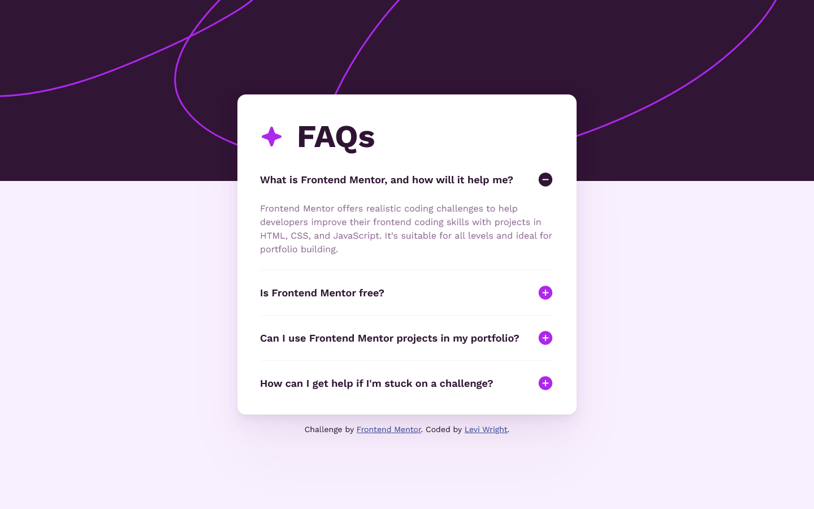
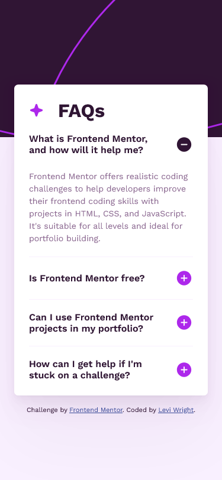

# Frontend Mentor - FAQ Accordion Solution

This is a solution to the [FAQ Accordion Challenge on Frontend Mentor](https://www.frontendmentor.io/challenges/faq-accordion-wyfFdeBwBz). Frontend Mentor challenges help you improve your coding skills by building realistic projects. 

## Table of Contents

- [Overview](#overview)
  - [The Challenge](#the-challenge)
    - [Extra Challenge](#extra-challenge)
  - [Screenshot](#screenshot)
  - [Links](#links)
- [My Process](#my-process)
  - [Built With](#built-with)
  - [What I Learned](#what-i-learned)
  - [Continued Development](#continued-development)
  - [Useful Resources](#useful-resources)
- [Author](#author)

## Overview

### The Challenge

Users should be able to:

- Hide/Show the answer to a question when the question is clicked
- Navigate the questions and hide/show answers using keyboard navigation alone
- View the optimal layout for the interface depending on their device's screen size
- See hover and focus states for all interactive elements on the page

#### Extra Challenge

- Complete the challenge without using JavaScript

### Screenshot




### Links

<!-- - Solution URL: [Frontend Mentor]() -->
- Live Site URL: [GitHub Pages](https://law973.github.io/faq-accordion/)

## My Process

### Built With

- Semantic HTML
- CSS Flexbox
- Media queries
- SCSS
- SCSS extends and mixins
- CSS/SCSS variables
- Mobile-first workflow

### What I Learned

I learned how to remove the default marker that comes with the summary element. Two settings need to be changed in order to cover a wide range of browsers:

```css
summary {
  list-style-type: none;

  &::-webkit-details-marker {
    display: none;
  }
}
```

Also, I found that the Safari browser requires more consideration in regards to the size settings of img elements. When using a width of 100% on the desktop background image, the image's width was fixed and did not change according to the viewport width. When using a width of 100vw, the image width was dynamic, but could not grow beyond whatever width the viewport happened to have when the page was loaded/refreshed. To solve this, the div containing the background images was given a width of 100%, and the background images were set to inherit their widths:

```css
.background__container {
  width: 100%;
}

.background__desktop, .background__mobile {
  width: inherit;
}
```

### Continued Development

I would like to continue using the details and summary elements and become more familiar with them; they're quite handy, but I don't think I've ever used them up until now.

### Useful Resources

- [Smooth Shadow](https://shadows.brumm.af/) - This tool helped me generate the box shadows used for the card.

## Author

- Website - [Levi Wright](https://leviwright.netlify.app/)
- Frontend Mentor - [@law973](https://www.frontendmentor.io/profile/law973)
- LinkedIn - [Levi Wright](https://www.linkedin.com/in/levi-arthur-wright/)
- GitHub - [@law973](https://github.com/law973)